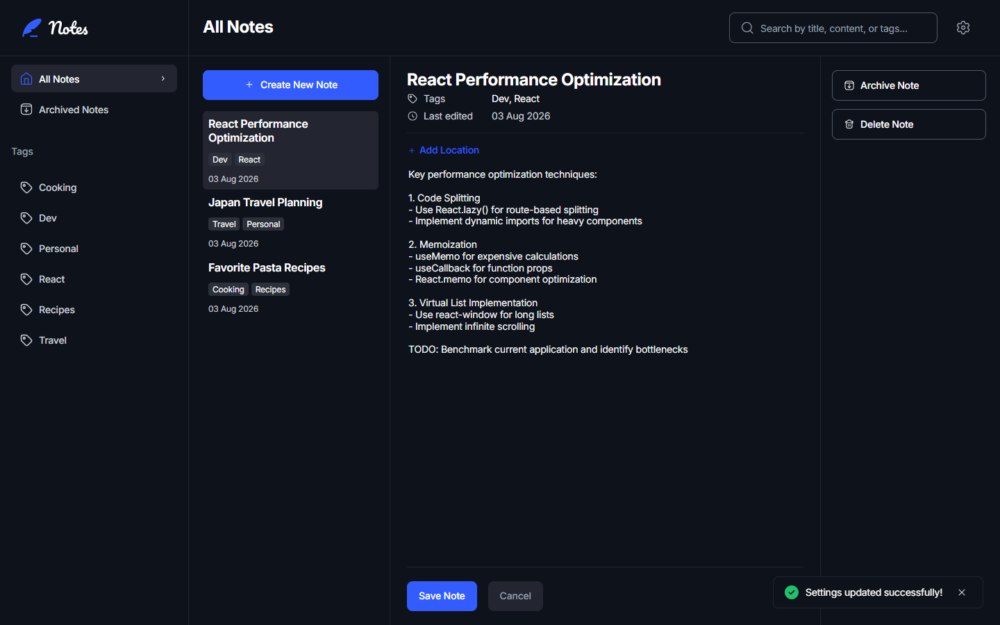
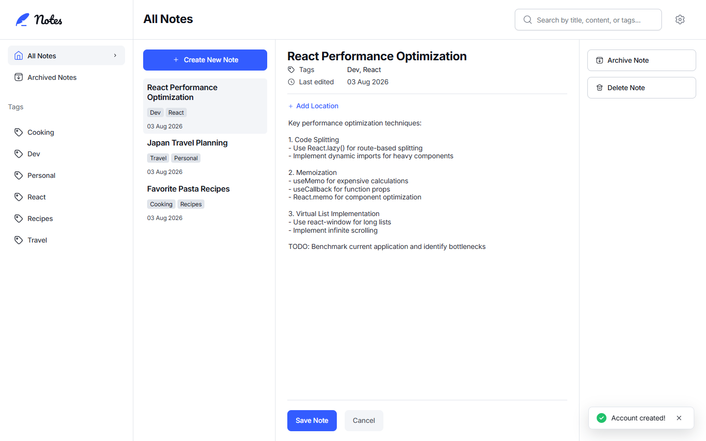
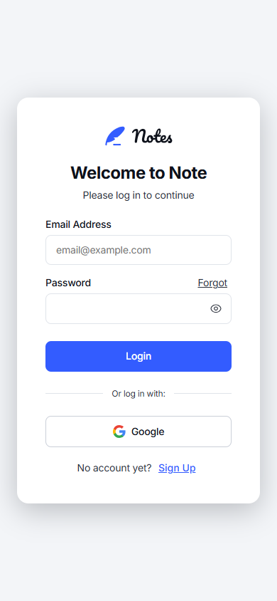
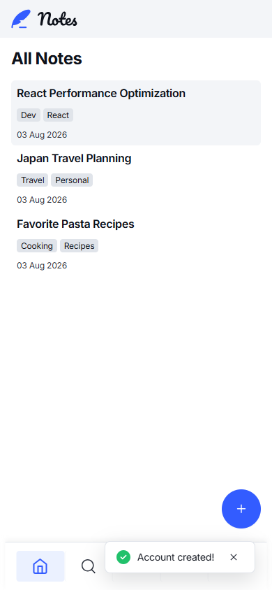
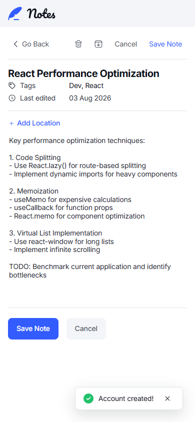

# Notes — A Vanilla JS Note-Taking App

A single-page note-taking app built for the "DOM & Browser APIs" lab assignment, using only HTML, CSS, and vanilla JavaScript (ES6 modules) — no frameworks, no build step, no dependencies.



## Project Overview

The app lets a user create, edit, tag, archive, and search notes, with everything persisted in the browser via `localStorage`. It's gated behind a small simulated login (no backend — see [Known limitations](#known-limitations)), and includes light/dark/system color themes, three font themes, unsaved-draft recovery, and optional geolocation tagging.

The focus of the assignment is DOM manipulation, event handling (especially delegation), and browser storage APIs — not visual design — but the UI was built to match a provided Figma spec as closely as possible.

## Features

- **Auth (simulated)**: Login, Sign Up, Forgot Password, and Reset Password screens gate the app, plus a Change Password panel in Settings.
- **Notes**: create, read, update, delete, with a title-required validation rule.
- **Archive**: archive/restore notes, with a separate Archived Notes view and its own empty state.
- **Tags**: add multiple tags to a note, filter by tag from a dynamically generated tag list (sidebar on desktop/tablet, a dedicated full-screen Tags page on mobile).
- **Search**: live search across title, content, and tags, spanning both active and archived notes, with a no-results state.
- **Themes**: light, dark, and "System" (follows the OS's `prefers-color-scheme`) color themes; sans-serif, serif, and monospace font themes — both persisted.
- **Validation**: a note's title is required, with an inline error, a disabled Save button, and validation on both blur and submit.
- **Drafts**: unsaved edits auto-save to `sessionStorage` and restore if the page reloads mid-edit.
- **Geolocation (bonus)**: attach your current coordinates to a note via the browser's Geolocation API, with graceful handling of denied permission or an unsupported browser.
- **Keyboard & accessibility**: full tab order, a focus trap in the confirmation modal, Escape to cancel/close, arrow-key navigation between notes, visible focus rings, and ARIA labels throughout.
- **Responsive**: three distinct layouts (see [Responsive design](#responsive-design)) — not just one breakpoint scaled down.

## Technologies

- **HTML5** — semantic elements, no `<div>` soup.
- **CSS3** — custom properties (design tokens) for colors/spacing/typography, Flexbox and Grid for layout, no preprocessor.
- **Vanilla JavaScript (ES6 modules)** — `import`/`export`, classes, arrow functions, template literals. No framework, no bundler, no npm dependencies at runtime.
- **Browser APIs** — `localStorage`, `sessionStorage`, Geolocation, `matchMedia`.

## Folder Structure

```
index.html          Semantic HTML skeleton for every screen/state
README.md
screenshots/         Images used in this README
src/
  css/
    styles.css       All styling: design tokens, base styles, dark theme, font themes, responsive breakpoints
  js/
    main.js          Entry point: wires the other modules together, owns app state, handles events
    storage.js       The only module that touches localStorage/sessionStorage
    noteManager.js   The Note data model and note business rules (create/delete/search/filter/tag/archive)
    auth.js          Password validation and login-matching rules for the simulated account
    ui.js            The only module that touches the DOM for rendering
    themes.js        Applies the color/font theme by setting attributes on <html>
```

## Installation

There's nothing to install — no `npm install`, no dependencies. Just clone or download the project folder.

## Running the Project

Because the app uses ES6 modules (`import`/`export`), it must be served over HTTP rather than opened directly as a `file://` URL — browsers block module imports from the filesystem for security reasons. Any static file server works, for example:

```bash
npx serve .
```

Then open the printed `localhost` URL in a browser.

## Architecture

Every module has one job, and data flows in one direction: an event fires → `main.js` asks `noteManager.js` to change the data → asks `storage.js` to persist it → asks `ui.js` to re-render. No module skips a layer — for example, `ui.js` never reads `localStorage` directly, and `storage.js`/`noteManager.js` never touch the DOM.

### Project flow

```
User Action  (click "Save Note", type in search, etc.)
     ↓
main.js       — the event listener figures out what happened
     ↓
noteManager.js — applies the business rule (create/update/delete/search/filter/tag/archive)
     ↓
storage.js    — persists the updated notes array to localStorage
     ↓
ui.js         — re-renders whatever changed in the DOM
     ↓
Updated Interface
```

Not every action touches every layer (e.g. toggling a theme goes through `themes.js` + `storage.js`, not `noteManager.js`), but the direction of the flow — main.js orchestrates, the other modules each do one job — is consistent throughout.

## Module Responsibilities

| Module | Responsibility |
|---|---|
| **`main.js`** | Entry point and the only file that wires everything together: looks up DOM elements once at the top, owns the app's in-memory state (`notes`, `selectedNoteId`, `activeTag`, `searchQuery`, `showingArchived`), and attaches every event listener. It's the composition root — it imports all four other modules but is never imported by them. |
| **`storage.js`** | The only module that calls `localStorage`/`sessionStorage`. Exports `saveNotes`/`loadNotes`, `savePreferences`/`loadPreferences`, `saveDraft`/`loadDraft`/`clearDraft`, plus account/session persistence for the simulated login. Every write goes through one shared helper that catches quota-exceeded errors. |
| **`noteManager.js`** | The `Note` class (with `archive()`, `restore()`, and `addTag()` methods) and the pure data-layer functions that operate on a notes array: `createNote`, `deleteNote`, `updateNote`, `updateArchivedStatus`, `searchNotes`, `filterByTag`, `getUniqueTags`. Never touches the DOM or storage — it only knows about data. |
| **`ui.js`** | The only module that touches the DOM for rendering. Builds note cards, tag icons, and the tag list from `document.createElement`/`createElementNS` (not `innerHTML`, so note content can never be interpreted as HTML), fills in the detail form, shows validation errors, and drives the toast/modal components. Never calls `localStorage` and never decides business rules. |
| **`themes.js`** | Applies the color theme ("light"/"dark"/"system") and font theme by setting `data-theme`/`data-font` attributes on `<html>`; the actual visual differences live in `styles.css`'s attribute selectors. |
| **`auth.js`** | Password-strength validation and login-matching rules for the simulated account. Never touches the DOM or storage. |

## Browser APIs Used

- **`localStorage`** — notes, user preferences (theme/font), and the simulated account/session, all as JSON strings via `JSON.stringify`/`JSON.parse`. Wrapped in a shared try/catch so a quota-exceeded error shows a message instead of crashing the app.
- **`sessionStorage`** — unsaved note drafts, so an accidental reload doesn't lose in-progress edits, but a draft doesn't outlive the browser tab the way a saved note does.
- **Geolocation API** — `navigator.geolocation.getCurrentPosition`, with a real error callback that distinguishes a denied permission from an unsupported browser, both shown as a toast rather than failing silently.
- **`matchMedia`** — used once, to resolve the "System" color theme against `prefers-color-scheme: dark` when the app starts.

## Accessibility

- Every interactive element is a real, natively-focusable HTML element (`<button>`, `<a href>`, form inputs) — no click-only `<div>`s.
- `aria-label` on every icon-only button, `aria-live="polite"` on the toast, `role="alertdialog"` + `aria-modal` + `aria-labelledby`/`aria-describedby` on the confirmation modal, `role="alert"` on inline field errors, `aria-current="page"` on the active nav link.
- Opening the confirmation modal moves focus onto its Confirm button and traps Tab/Shift+Tab between Cancel and Confirm while it's open; closing it (by Confirm, Cancel, backdrop click, or Escape) returns focus to whatever originally opened it.
- Escape closes the modal if one is open, or cancels an in-progress note edit if focus is inside the note form.
- A single global `:focus-visible` rule puts a visible outline on every interactive element for keyboard users, without showing it on a mouse click.
- Arrow-key (Up/Down) navigation between note cards, as a bonus beyond plain Tab order.

## Responsive Design

Three genuinely distinct layouts, not one design squeezed to fit every width:

| Breakpoint | Layout |
|---|---|
| **Mobile** (≤767px) | Single-column, one view at a time (list *or* detail *or* tags *or* settings), a bottom nav bar, and a floating "+" button. |
| **Tablet** (768–899px) | A sidebar (with the tag list) alongside the notes list/detail, which still step one-at-a-time like mobile — there's no room for a 3rd column at this width, so it reuses the same mobile toolbar (Go Back, delete, archive, Cancel, Save Note) instead of the desktop's separate action panel. |
| **Desktop** (≥900px) | A 4-column grid — sidebar, notes list, note detail, and a dedicated actions panel — all visible at once. |

Tested in both portrait and landscape at each breakpoint; nothing depends on a fixed aspect ratio.

## Screenshots

| Desktop (light) | Desktop (dark) |
|---|---|
|  |  |

| Mobile — login | Mobile — notes list | Mobile — note detail |
|---|---|---|
|  |  |  |

## Known Limitations

These were deliberate choices, not oversights — noted here in case they come up in review:

- **Auth is simulated, not real security.** The assignment describes a single-user, client-side-only app with no backend, so there is nowhere secure to check a password. Sign Up stores one plain-text `{ email, password }` account in `localStorage` (see `auth.js`'s file comment); Login compares against it directly. This is enough to demonstrate the full flow (including validation, a "forgot password" simulation, and session persistence across reloads) but must never be mistaken for real authentication — anyone with access to the browser's dev tools can read or change the stored credentials. The "Log in with Google" button is decorative (shows a toast) since real OAuth requires a backend and a registered client ID.
- **`main.js` is larger than a typical single-responsibility file** (around 1,200 lines). It's the composition root for a genuinely multi-feature app (auth, CRUD, archive, tags, search, settings, modals, drafts, geolocation, keyboard handling, and separate mobile-only view logic), and splitting it further would mean adding files beyond the assignment's specified five modules (`auth.js` was already an intentional, justified exception — see [Module Responsibilities](#module-responsibilities)). Each concern is grouped under a clear section comment and is independently easy to point to and explain in a walkthrough.
- **Geolocation stores raw coordinates**, not a city name. Reverse-geocoding a coordinate into a city requires a third-party API (and typically an API key), which would add an external network dependency this project otherwise avoids.
- **Sample data is 3 notes**, not a large dataset, since the point of the seed data is just to demonstrate the app on first run, not to stress-test it.
- **Bonus search-term highlighting is not implemented.** Search itself (title/content/tags, real-time, no-results state) is complete; highlighting the matched substring in results was left out as a bonus, not a core requirement.

## Future Improvements

- Reverse-geocode a note's coordinates into a readable city/place name.
- Highlight the matched search term within note titles/content (the bonus mentioned above).
- Export/import notes as a JSON file.
- A reactive "System" theme that responds live to an OS theme change while the tab is open, instead of only checking once at load/apply time.

## Demoing each feature (for the lab review)

| Feature | How to show it |
|---|---|
| Auth (simulated) | Sign Up with any email + 8+ character password (auto-logs you in). Settings → Logout. Log back in with the same credentials. Try "Forgot" → wrong email shows an error, the account's email reveals a "continue to reset" link (simulating the emailed link) → set a new password → log in with it. Or Settings → Change Password (wrong old password / weak new password / mismatched confirm all show inline errors). |
| Create/Read/Update/Delete | Click "+ Create New Note", fill it in, Save. Edit any field on an existing note and Save. Click Delete Note and confirm. |
| Archive/Restore | Open a note, click Archive Note, confirm. Click "Archived Notes" in the sidebar to see it; open it and click Restore Note. |
| Tags | Type tags (comma-separated) into a note, save, then click that tag in the sidebar (or the mobile Tags page) to filter. |
| Search | Type into the header search box; try a term that only matches an archived note's tag. |
| Validation | Create a new note and leave the title blank — Save is disabled and an error shows on blur/submit. |
| Drafts | Start editing a note, type something, then reload the page — the unsaved text is still there. |
| Themes/Fonts | Settings (gear icon) → Color Theme / Font Theme → pick an option → Apply Changes. |
| Geolocation | Open a note, click "+ Add Location" (browser will prompt for permission). |
| Keyboard | Tab through the app; use Up/Down arrows on a focused note card; open a modal and press Tab (it stays trapped) or Escape (it closes and focus returns). |
| Responsive | Resize the browser window across ~767px and ~900px, or use dev tools' device toolbar — check both portrait and landscape. |

## Commit History

The commit history is organized as one commit per feature milestone or fix, each independently reviewable and testable. Run `git log --oneline` to see the full sequence.
